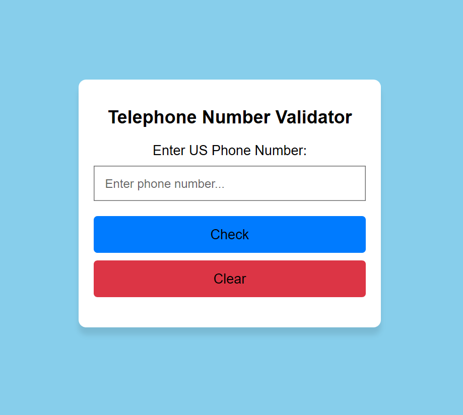

# telephone-number-validator

> This project is a web-based telephone number validator created using HTML, CSS, and JavaScript. It allows users to input a phone number and instantly verifies if it matches the US phone number format. The interface is designed to be intuitive and responsive, providing immediate feedback on whether the entered phone number is valid or not.



1[livelink](https://nooria150.github.io/telephone-number-validator/)

## Technologies Used 🛠️

- HTML
- CSS
- JavaScrip

## Usage 🎯

clone the project 

```bash
# git clone
```

```bash
# cd (choose a file)
```

```bash
code .
```

## Author 👩‍💻

- [Email](nooriamangal@gmail.com)
- [github](https://github.com/Nooria150)
 